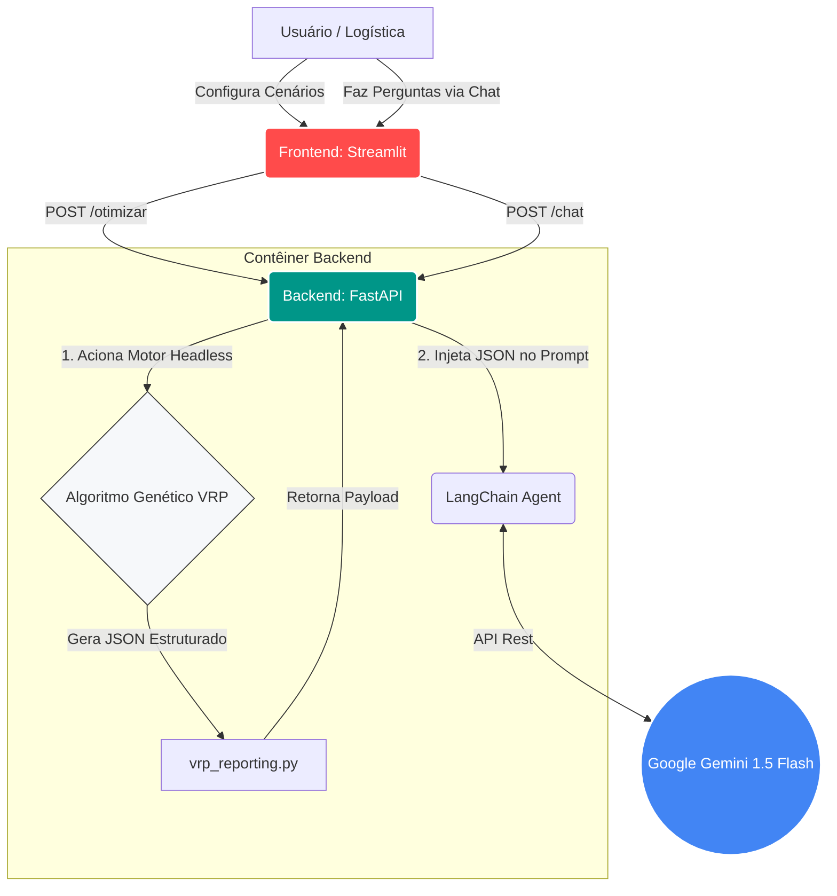

# Otimizador de Rotas Hospitalares & Assistente Logístico IA

Projeto desenvolvido para o Tech Challenge da Fase 2 da FIAP. O sistema utiliza algoritmos genéticos para otimizar rotas de entrega de medicamentos e insumos hospitalares.

O motor de roteamento possui duas implementações base:

- **TSP original:** versão inicial do problema do caixeiro viajante, mantida para comparação.
- **VRP otimizado:** versão hospitalar com múltiplos veículos, prioridades, capacidade de carga e autonomia.

A arquitetura do projeto foi expandida para suportar duas formas de execução independentes: uma **Aplicação Web (Microsserviços)** com Inteligência Artificial e uma **Interface CLI (Local)** para visualizações matemáticas e testes de estresse.

## Requisitos

**Para a Aplicação Web (IA e Dashboards):**

- Docker e Docker Compose.
- Chave de API do Google AI Studio (Gemini).

**Para a Execução Local (CLI e Pygame):**

- Python 3.9 e Conda.
- Sistema operacional com suporte ao Pygame.
- As dependências estão declaradas em `environment.yml`.

---

## 1. Execução via Docker (Frontend, Backend e IA)

Esta é a forma recomendada para demonstrar a solução completa, englobando o motor de roteamento e a geração de relatórios logísticos via LLM.

**Configuração da Chave de API:**
Na raiz do projeto, crie um arquivo `.env` e insira sua chave do Google Gemini:

```env
GOOGLE_API_KEY=sua_chave_gemini_aqui
```

**Subindo a Aplicação:**
No terminal, execute o orquestrador de contêineres na raiz do projeto:

```bash
docker-compose up --build
```

- **Painel Interativo (Streamlit):** Acesse `http://localhost:8501`.
- **Documentação da API (FastAPI):** Acesse `http://localhost:8000/docs`.

A interface enviará os parâmetros para o backend, que executará o algoritmo genético e repassará os dados estruturados para o LangChain interpretar e formular as instruções aos motoristas. O sistema web também inclui um chat interativo, permitindo que os usuários façam perguntas em linguagem natural sobre as rotas geradas e restrições operacionais.

---

## 2. Execução Local via Conda (CLI e Benchmarks)

Ideal para visualização detalhada em tempo real (via Pygame) da evolução das rotas e diagnóstico de viabilidade. Também permite a execução de benchmarks estatísticos entre diferentes estratégias de roteamento.

### Instalação

Na pasta do projeto, crie e ative o ambiente Conda:

```bash
conda env create --file environment.yml
conda activate fiap_tsp
```

Para atualizar um ambiente já existente: `conda env update --file environment.yml --prune`.

### Visualização por Cenário (Pygame)

O ponto de entrada local é `main.py`. O modo VRP otimizado é executado por padrão.

```bash
python main.py
```

Para visualizar um cenário específico em tempo real, limitando as gerações:

```bash
python main.py --mode vrp --scenario alta_demanda --generations 1000
```

Cenários disponíveis: `base`, `alta_prioridade`, `alta_demanda`, `baixa_autonomia`, `frota_reduzida`, `maior`, `capacidade_insuficiente` e `autonomia_insuficiente`.

Durante a execução, pressione `Q` ou feche a janela para encerrar o programa. O vizinho mais próximo é determinístico e também passa pelo reparo de rotas antes da avaliação; em cenários fisicamente inviáveis (ex: demanda superior à capacidade), a solução permanece inválida e a penalização é preservada.

### Benchmark Estatístico

O benchmark compara três estratégias de roteamento: rota aleatória, vizinho mais próximo e algoritmo genético.

Execute uma rodada de testes:

```bash
python vrp_benchmark.py --repetitions 10 --generations 1000
```

Para executar todos os cenários disponíveis e exportar resultados consolidados:

```bash
python vrp_benchmark.py \
	--scenarios base alta_prioridade alta_demanda baixa_autonomia frota_reduzida maior \
	--repetitions 10 \
	--generations 1000 \
	--output benchmark_results_all.csv
```

Os resultados são salvos automaticamente na pasta `results/`, gerando arquivos de métricas de cada execução (`.csv`), resumos estatísticos (`_summary.csv`) e melhor fitness registrado a cada geração (`_evolution.csv`). O resumo estatístico separa a distância física das penalizações por restrições.

### Testes Automatizados

Execute os testes da lógica de roteamento com:

```bash
python -m unittest -v test_vrp.py
```

Execute os testes automatizados da API Web (FastAPI) com:

```bash
pytest backend/test_api.py
```

---

## Integração com IA e Relatórios

O modo `vrp` monta, ao final de cada execução, um report estruturado em formato JSON por meio da função `build_solution_summary()` em `vrp_reporting.py`.

O payload base contém:

- **Instruções de entrega:** rota ordenada, posição, ID, prioridade, demanda, localização e distância de cada trecho.
- **Relatórios de eficiência:** fitness, distância, penalizações, utilização de capacidade/autonomia, evolução por geração e validade.
- **Sugestões logísticas:** violações, entregas críticas, gargalos de restrições e diagnóstico de viabilidade factual.

**O Fluxo de Processamento de Linguagem Natural (PLN):** Ao rodar a aplicação Web, esse payload JSON é extraído pelo backend (FastAPI) e fornecido como contexto estruturado para o modelo **Gemini 1.5 Flash** através do LangChain. A IA traduz as métricas logísticas gerando instruções precisas em linguagem natural e apontando gargalos de operação diretamente na tela do Streamlit. Além disso, a integração com o LangChain habilita um endpoint de chat dinâmico focado no contexto do roteamento atual.

---

## Arquivos Principais

**Microsserviços e APIs:**

- `backend/main.py`: Endpoints da API e chamadas de microsserviço.
- `backend/api_bridge.py`: Ponte de execução para o algoritmo genético em modo headless (sem interface gráfica).
- `backend/llm_agent.py`: Configuração do agente de PLN via LangChain.
- `backend/test_api.py`: Testes automatizados da API.
- `frontend/app.py`: Interface de usuário interativa (Streamlit).
- `docker-compose.yml`: Orquestração de infraestrutura local.

**Domínio VRP e Algoritmo Genético:**

- `main.py`: Ponto de entrada CLI (seleciona a implementação original).
- `vrp.py`: Execução e visualização Pygame do VRP hospitalar.
- `vrp_domain.py`: Modelos de classes e carregamento de dados.
- `vrp_genetic.py` / `vrp_evaluator.py`: Motor de evolução, crossover, mutação e cálculo de penalizações.
- `vrp_repair.py` / `vrp_feasibility.py`: Reparo de rotas inválidas e relatórios de viabilidade.
- `vrp_reporting.py`: Empacotador do resumo estruturado em JSON para integração com LLM.
- `vrp_benchmark.py`: Testes estatísticos entre estratégias.
- `data/scenarios.json`: Definição de restrições aplicadas sobre o cenário-base.
- `tsp_base/`: Módulos, scripts e benchmark exclusivos do TSP original.

## Diagrama de Arquitetura


