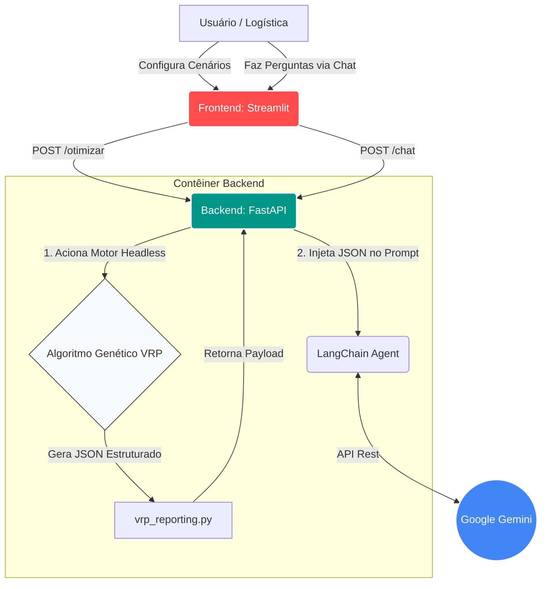

# Otimizador de Rotas Hospitalares & Assistente Logístico IA

Projeto desenvolvido para o Tech Challenge da Fase 2 da FIAP. O sistema utiliza algoritmos genéticos para otimizar rotas de entrega de medicamentos e insumos hospitalares, além de oferecer uma camada de inteligência artificial para interpretar resultados logísticos e responder perguntas em linguagem natural.

O motor de roteamento possui duas implementações base:

- **TSP original:** versão inicial do problema do caixeiro viajante, mantida para comparação e validação.
- **VRP otimizado:** versão hospitalar com múltiplos veículos, prioridades, capacidade de carga e autonomia.

A arquitetura do projeto foi expandida para suportar duas formas de execução independentes:

- **Aplicação Web (Microsserviços):** backend em FastAPI + frontend em Streamlit + integração com Gemini.
- **Interface CLI (Local):** execução direta em Python, com visualização em Pygame e benchmark estatístico.

## Requisitos

### Para a Aplicação Web (IA e Dashboards)

- Docker e Docker Compose.
- Chave de API do Google AI Studio (Gemini).

### Para a Execução Local (CLI e Pygame)

- Python 3.9.
- Conda.
- Sistema operacional com suporte ao Pygame.

As dependências do ambiente local estão em [environment.yml](environment.yml).

---

## 1. Execução via Docker (Frontend, Backend e IA)

Esta é a forma recomendada para demonstrar a solução completa, incluindo o motor de roteamento, API, dashboard e geração de instruções logísticas via IA.

### Configuração da Chave de API

Na raiz do projeto, crie um arquivo `.env` com a seguinte variável:

```env
GOOGLE_API_KEY=sua_chave_gemini_aqui
```

### Subindo a aplicação

No terminal, na raiz do projeto, execute:

```bash
docker-compose up --build
```

A partir daí, os serviços ficam disponíveis em:

- **Painel interativo (Streamlit):** http://localhost:8501
- **Documentação da API (FastAPI):** http://localhost:8000/docs

A interface envia os parâmetros para o backend, que executa o algoritmo genético e retorna um payload estruturado para o LangChain interpretar e traduzir em instruções operacionais em linguagem natural. O frontend também inclui um chat interativo para perguntas sobre as rotas geradas, restrições e desempenho.

---

## 2. Execução Local via Conda (CLI e Benchmarks)

Ideal para visualização detalhada em tempo real da evolução das rotas, diagnósticos de viabilidade e comparação estatística entre estratégias.

### Instalação

Na pasta do projeto, crie e ative o ambiente Conda:

```bash
conda env create --file environment.yml
conda activate fiap_tsp
```

Para atualizar um ambiente já existente:

```bash
conda env update --file environment.yml --prune
```

### Execução do modo local

O ponto de entrada local é [main.py](main.py). O modo VRP otimizado é executado por padrão:

```bash
python main.py
```

Para executar explicitamente o VRP hospitalar:

```bash
python main.py --mode vrp
```

Para visualizar um cenário específico em tempo real:

```bash
python main.py --mode vrp --scenario alta_demanda --generations 1000
```

Cenários disponíveis: `base`, `alta_prioridade`, `alta_demanda`, `baixa_autonomia`, `frota_reduzida`, `maior`, `capacidade_insuficiente` e `autonomia_insuficiente`.

Durante a execução, pressione `Q` ou feche a janela para encerrar o programa.

O vizinho mais próximo é determinístico e também passa pelo reparo de rotas antes da avaliação. Em cenários fisicamente inviáveis, como demanda superior à capacidade disponível ou autonomia insuficiente, a solução permanece inválida e a penalização é preservada.

Para executar o TSP original:

```bash
python main.py --mode tsp
```

Também é possível executar os módulos diretamente:

```bash
python -m tsp_base.tsp
python -m vrp.vrp_app
```

### Limite de gerações

É possível definir um limite de gerações para comparar implementações em condições equivalentes:

```bash
python main.py --mode tsp --generations 1000
python main.py --mode vrp --generations 1000
```

Sem o parâmetro `--generations`, a execução continua até o usuário pressionar `Q`.

### Visualização por cenário

O modo otimizado permite visualizar os cenários disponíveis em tempo real. A janela mostra o mapa, as rotas, a sequência de entregas, as prioridades, os indicadores dos veículos e a evolução do fitness.

```bash
python main.py --mode vrp --scenario base --generations 1000
python main.py --mode vrp --scenario alta_prioridade --generations 1000
python main.py --mode vrp --scenario alta_demanda --generations 1000
python main.py --mode vrp --scenario baixa_autonomia --generations 1000
python main.py --mode vrp --scenario frota_reduzida --generations 1000
python main.py --mode vrp --scenario maior --generations 1000
```

Para deixar a simulação rodando até o usuário pressionar `Q`, omita o limite:

```bash
python main.py --mode vrp --scenario alta_demanda
```

Ao finalizar cada execução do modo `vrp`, o sistema monta um relatório estruturado em formato JSON com dados da solução, entregas, veículos, restrições e evolução. Esse relatório pode ser salvo em [results](results) por meio dos módulos de benchmark e também é consumido pela API para geração de texto por IA.

---

## 3. Benchmark Estatístico

O benchmark compara três estratégias de roteamento:

- Rota aleatória.
- Vizinho mais próximo.
- Algoritmo genético.

### Executando uma rodada de testes

```bash
python -m vrp.vrp_benchmark --repetitions 10 --generations 1000
```

### Executando todos os cenários disponíveis

```bash
python -m vrp.vrp_benchmark \
    --scenarios base alta_prioridade alta_demanda baixa_autonomia frota_reduzida maior \
    --repetitions 10 \
    --generations 1000 \
    --output benchmark_results_all.csv
```

Os cenários variam a quantidade de entregas, prioridades, demandas, autonomia e tamanho da frota. Os resultados são salvos automaticamente na pasta [results](results), gerando arquivos de métricas detalhadas (`.csv`), resumos estatísticos (`_summary.csv`) e melhor fitness registrado por geração (`_evolution.csv`).

O resumo separa `mean_distance`, `mean_penalty` e `mean_fitness`, permitindo diferenciar a distância física das penalizações por restrições.

Também é possível escolher um nome de saída personalizado:

```bash
python -m vrp.vrp_benchmark --repetitions 10 --generations 1000 --output resultados.csv
```

Nesse caso, os arquivos são salvos como:

```text
results/resultados.csv
results/resultados_summary.csv
```

Para uma execução rápida de validação:

```bash
python -m vrp.vrp_benchmark --scenarios base --repetitions 1 --generations 5 --output benchmark_smoke.csv
```

---

## 4. Testes Automatizados

### Testes do motor de roteamento

```bash
python -m unittest -v vrp/test_vrp.py
```

Para executar apenas os testes sem detalhes:

```bash
python -m unittest -q vrp/test_vrp.py
```

### Testes da API Web

Os testes do backend estão em [backend/test_api.py](backend/test_api.py). Se o ambiente tiver `pytest` instalado, a execução é:

```bash
pytest backend/test_api.py
```

### Verificação de sintaxe

```bash
python -m py_compile main.py \
    vrp/vrp_app.py vrp/vrp_domain.py vrp/vrp_evaluator.py vrp/vrp_repair.py \
    vrp/vrp_genetic.py vrp/vrp_benchmark.py vrp/vrp_scenarios.py vrp/test_vrp.py \
    tsp_base/tsp.py tsp_base/__init__.py tsp_base/genetic_algorithm.py \
    tsp_base/draw_functions.py tsp_base/benchmark_att48.py
```

---

## 5. Integração com IA e Relatórios

O modo `vrp` monta, ao final de cada execução, um relatório JSON estruturado por meio da função `build_solution_summary()` em [vrp/vrp_reporting.py](vrp/vrp_reporting.py). Esse payload é usado tanto por dashboards quanto pela camada de IA.

O conteúdo do relatório inclui:

- **Instruções de entrega:** rota ordenada, posição, ID, prioridade, demanda, localização e distância de cada trecho.
- **Relatórios de eficiência:** fitness, distância, penalizações, utilização de capacidade e autonomia, evolução por geração e validade.
- **Sugestões logísticas:** violações, entregas críticas, gargalos de capacidade e autonomia, diagnóstico de viabilidade e recomendações.

O campo `comparison` pode receber resultados de outros métodos, como vizinho mais próximo, permitindo comparação direta de desempenho. O campo `transport` pode receber uma velocidade média para estimar o tempo total da rota.

No fluxo web, o backend em [backend/main.py](backend/main.py) chama [backend/api_bridge.py](backend/api_bridge.py), executa o algoritmo genético em modo headless e injeta o JSON resultante no LLM configurado em [backend/llm_agent.py](backend/llm_agent.py). O frontend em [frontend/app.py](frontend/app.py) exibe esse resumo e também oferece um chat para perguntas em linguagem natural.

---

## 6. Estrutura de Diretórios

- [main.py](main.py): ponto de entrada da execução local.
- [backend/](backend/): API FastAPI, ponte de integração e agente LLM.
- [frontend/](frontend/): dashboard interativo em Streamlit.
- [vrp/](vrp/): domínio do problema, algoritmo genético, avaliação, reparo e benchmark do VRP.
- [tsp_base/](tsp_base/): implementação original do TSP e módulos auxiliares.
- [data/](data/): cenários e configurações do problema.
- [results/](results/): relatórios, benchmarks e arquivos de saída.
- [docker-compose.yml](docker-compose.yml): orquestração dos serviços web.
- [environment.yml](environment.yml): ambiente Conda do projeto.

---

## 7. Arquitetura do Sistema



---

## 8. Dados e Configuração

Os cenários do problema e os parâmetros do algoritmo ficam separados do código principal:

- [data/hospital_scenario.json](data/hospital_scenario.json): cenário-base hospitalar.
- [data/scenarios.json](data/scenarios.json): alterações aplicadas sobre o cenário-base.
- [data/algorithm_config.json](data/algorithm_config.json): parâmetros do algoritmo genético.

---

## Integrantes

- Cristofer Gaier Sais (rm374802)
- Luciano Gomes Pereira Júnior (rm374898)
